# Diagramas de Migrations - DoctrineMigrationsBundle

## 📊 Diagramas Visuais para Entender Migrations

---

## 1. Fluxo Completo de Migration

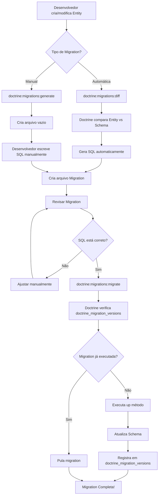

---

## 2. Como Doctrine Rastreia Migrations

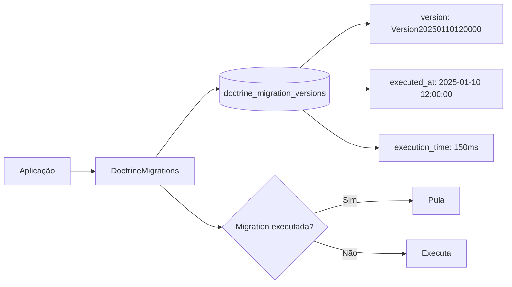

---

## 3. Ciclo de Vida de uma Migration

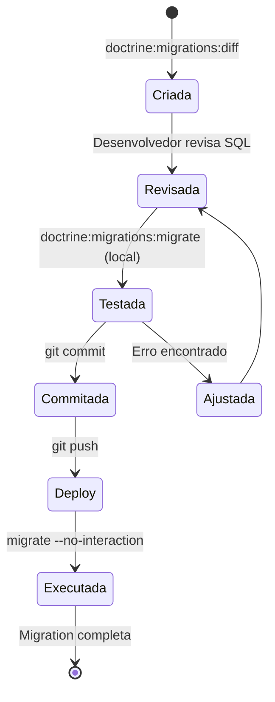

---

## 4. Comparação: Com vs Sem Migrations

### Sem Migrations (Problemático)
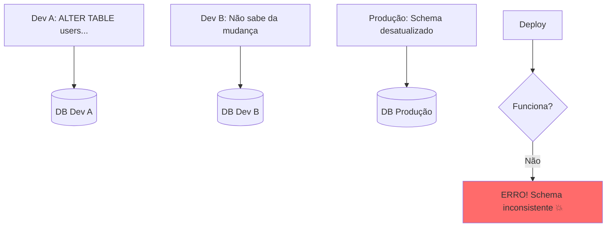

### Com Migrations (Solução)
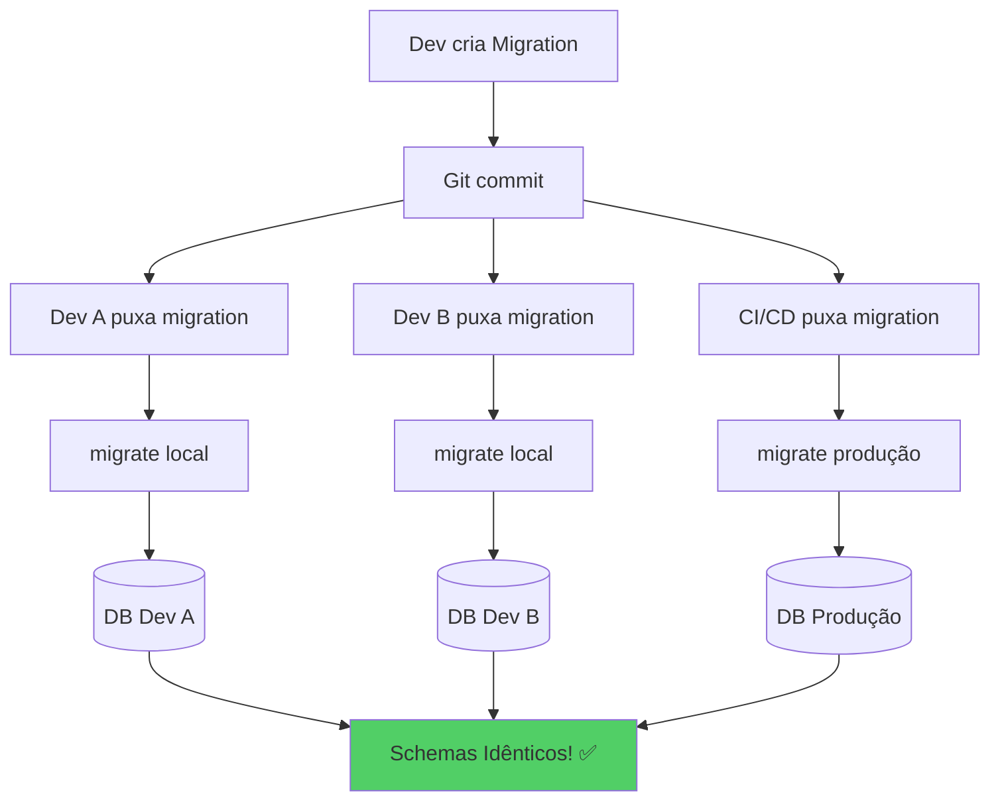

---

## 5. Estrutura de Arquivos

```
hidro-api/
├── migrations/                          ← Pasta de migrations
│   ├── Version20250108000001.php       ← Migration 1 (executada)
│   ├── Version20250109000001.php       ← Migration 2 (executada)
│   └── Version20250110120000.php       ← Migration 3 (pendente)
│
├── src/
│   └── Domain/
│       ├── Users/
│       │   └── User.php                ← Entity modificada
│       └── Schools/
│           └── School.php              ← Entity nova
│
├── config/
│   └── packages/
│       └── doctrine_migrations.yaml    ← Configuração
│
└── .env                                 ← DATABASE_URL
```

---

## 6. Fluxo de Deploy em Produção

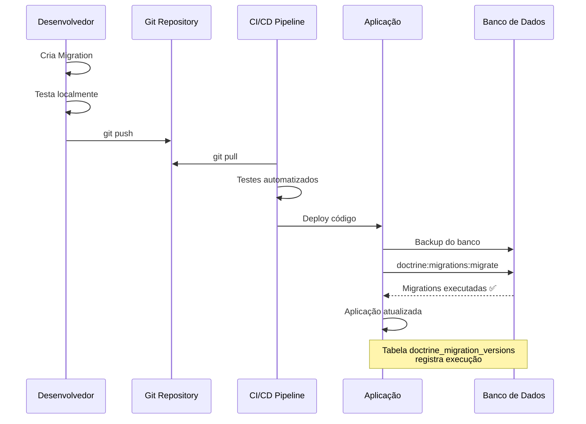

---

## 7. Anatomia de uma Migration

```php
// migrations/Version20250110120000.php

┌─────────────────────────────────────────────────────┐
│ Namespace: DoctrineMigrations                       │
├─────────────────────────────────────────────────────┤
│ Classe: Version20250110120000                       │
│         └─ Timestamp único evita conflitos          │
├─────────────────────────────────────────────────────┤
│ getDescription(): string                            │
│ └─ "Add email field to User entity"                │
├─────────────────────────────────────────────────────┤
│ up(Schema $schema): void                            │
│ ├─ SQL para APLICAR mudança                        │
│ └─ addSql('ALTER TABLE users ADD email...')        │
├─────────────────────────────────────────────────────┤
│ down(Schema $schema): void                          │
│ ├─ SQL para REVERTER mudança                       │
│ └─ addSql('ALTER TABLE users DROP email')          │
└─────────────────────────────────────────────────────┘
```

---

## 8. Tabela doctrine_migration_versions

```
┌──────────────────────────────────────────────────────────┐
│              doctrine_migration_versions                  │
├───────────────────────────┬──────────────┬───────────────┤
│ version (VARCHAR 192)     │ executed_at  │ execution_time│
├───────────────────────────┼──────────────┼───────────────┤
│ DoctrineMigrations\       │ 2025-01-08   │ 120 ms        │
│ Version20250108000001     │ 10:00:00     │               │
├───────────────────────────┼──────────────┼───────────────┤
│ DoctrineMigrations\       │ 2025-01-09   │ 85 ms         │
│ Version20250109000001     │ 11:30:00     │               │
├───────────────────────────┼──────────────┼───────────────┤
│ DoctrineMigrations\       │ 2025-01-10   │ 150 ms        │
│ Version20250110120000     │ 12:00:00     │               │
└───────────────────────────┴──────────────┴───────────────┘

→ Doctrine consulta esta tabela para saber quais migrations já foram executadas
→ Apenas migrations NÃO presentes aqui serão executadas
```

---

## 9. Workflow Automático vs Manual

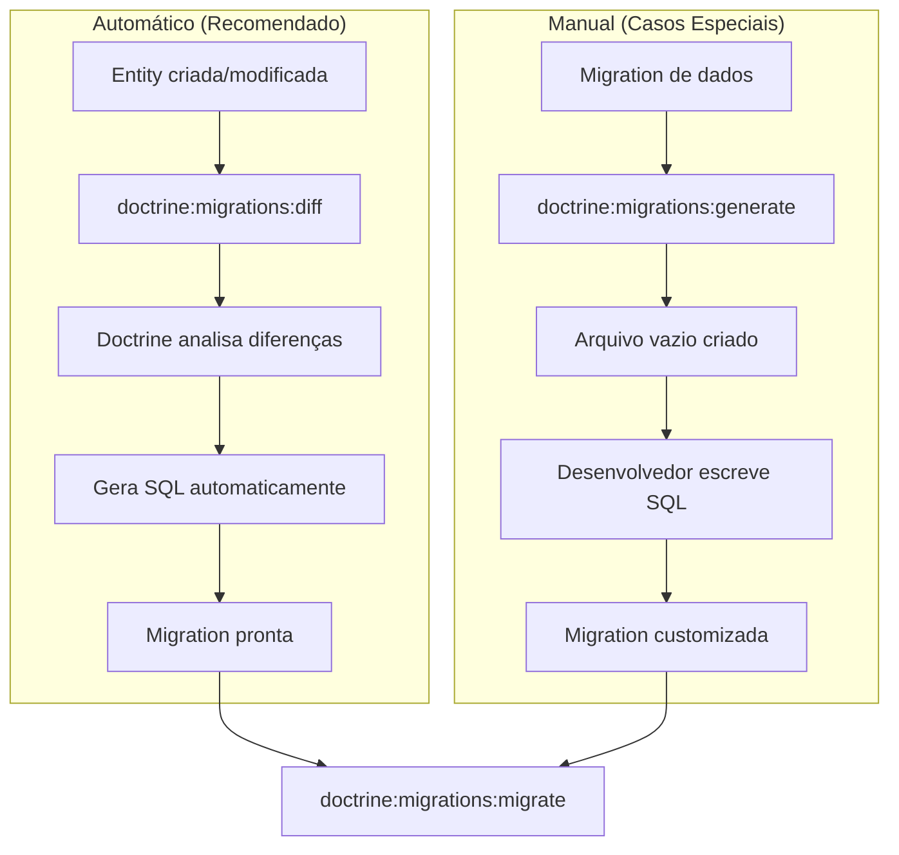

---

## 10. Processo de Comparação (diff)

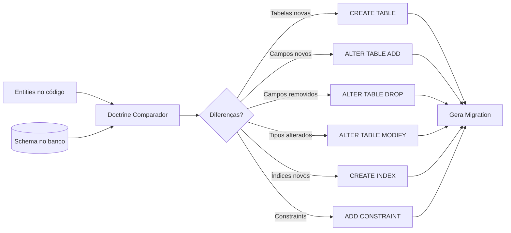

---

## 11. Reversibilidade (up vs down)

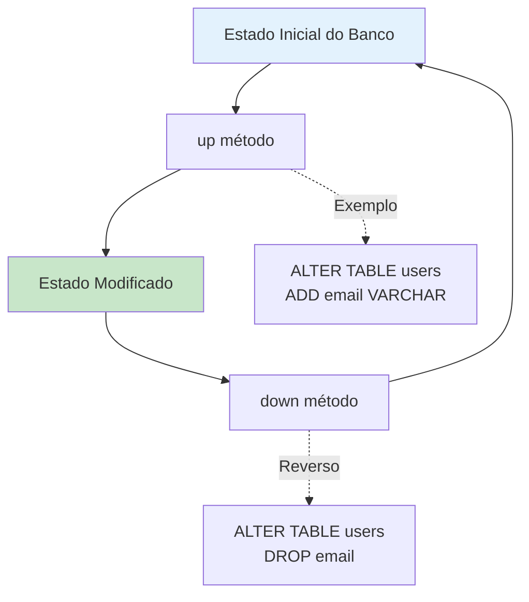

---

## 12. Estratégia de Versionamento

```
Timeline de Migrations:

2025-01-08 10:00:00 → Version20250108100000
                      └─ Create users table
                      
2025-01-09 11:30:00 → Version20250109113000
                      └─ Add email to users
                      
2025-01-10 12:00:00 → Version20250110120000
                      └─ Create products table
                      
2025-01-10 15:45:00 → Version20250110154500
                      └─ Add foreign key users_products

Ordem de execução = Ordem cronológica (timestamp)
```

---

## 13. Cenário de Erro e Recuperação

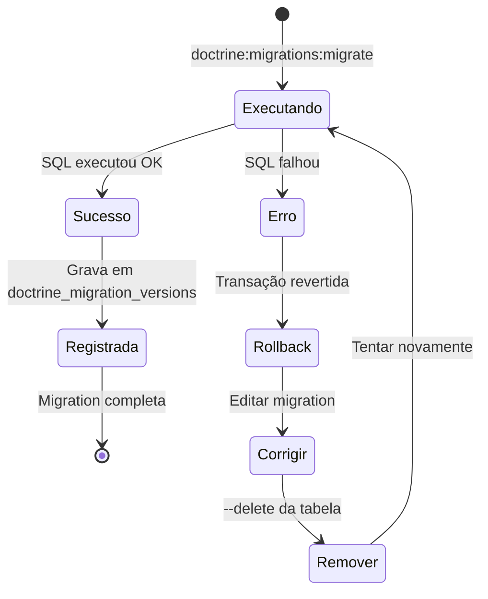

---

## 14. Múltiplos Ambientes

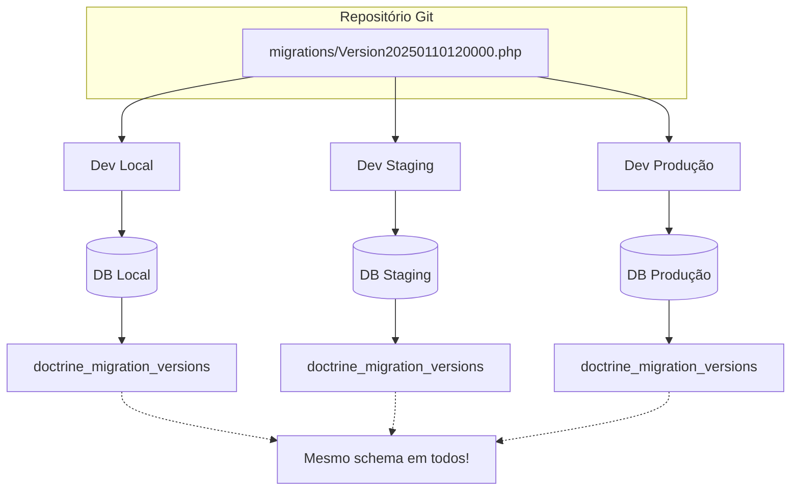

---

## 15. Decisão: Quando Usar Cada Comando

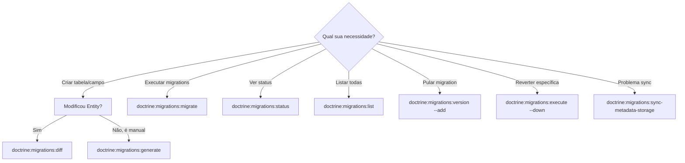

---

## 16. Dependências e Ordem de Execução

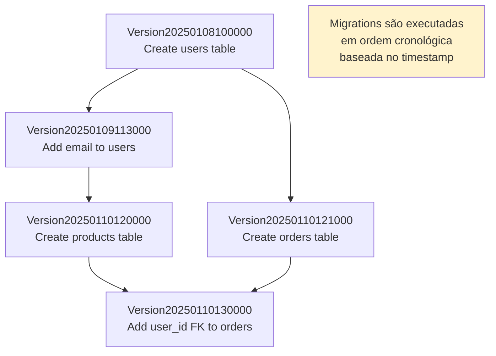

---

## Resumo Visual

### Regra de Ouro
```
┌───────────────────────────────────────────────────┐
│  Entity mudou → diff → migrate → commit → deploy  │
└───────────────────────────────────────────────────┘
```

### Comandos Mais Usados
```
1. doctrine:migrations:status  ← Ver situação atual
2. doctrine:migrations:diff    ← Criar automaticamente
3. doctrine:migrations:migrate ← Executar
```

### Arquivos Importantes
```
migrations/Version*.php        ← Código SQL versionado
doctrine_migration_versions    ← Rastreamento no banco
config/packages/doctrine_migrations.yaml ← Configuração
```

---

**Para mais detalhes**: Veja [`GUIA_MIGRATIONS.md`](GUIA_MIGRATIONS.md)
