# Diagramas do Módulo de Usuários

## 📊 Diagramas Visuais

---

## 1. Arquitetura em Camadas

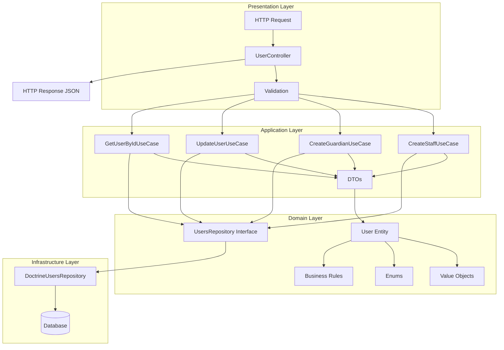

---

## 2. Estrutura de Domínio (Domain Layer)

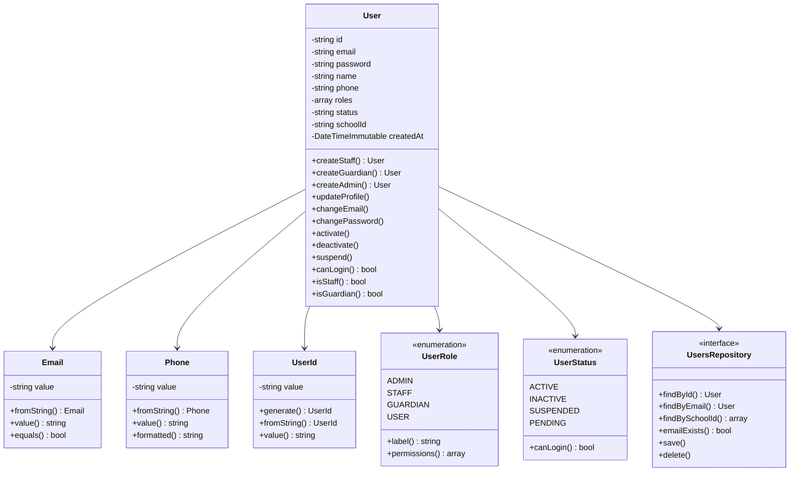

---

## 3. Fluxo de Criação de Staff

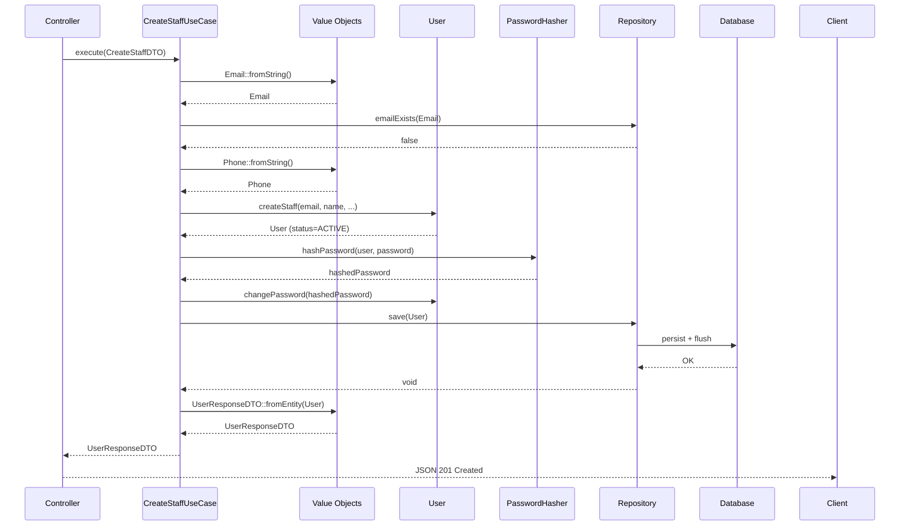

---

## 4. Fluxo de Criação de Responsável

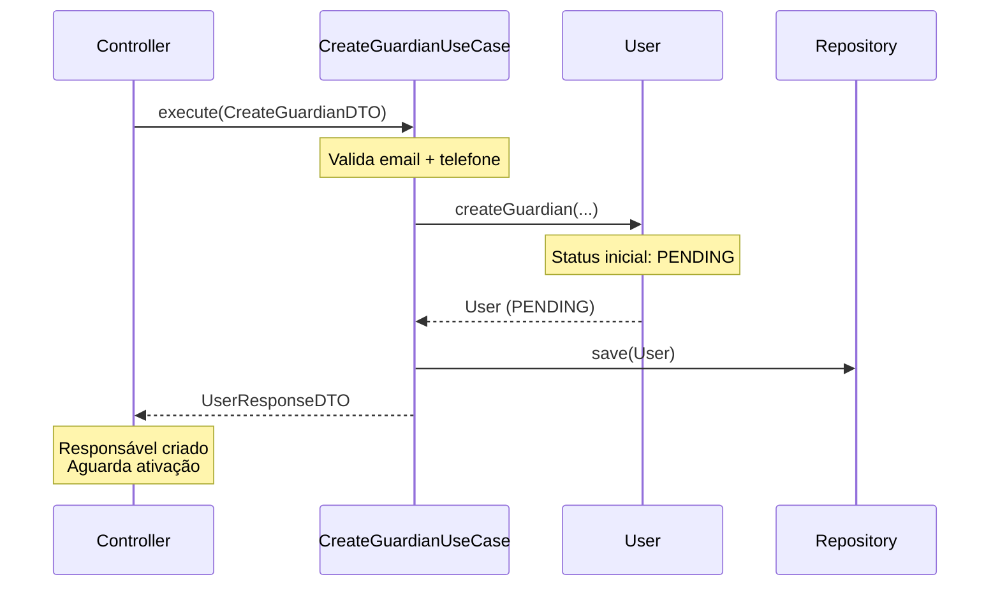

---

## 5. Fluxo de Ativação de Responsável

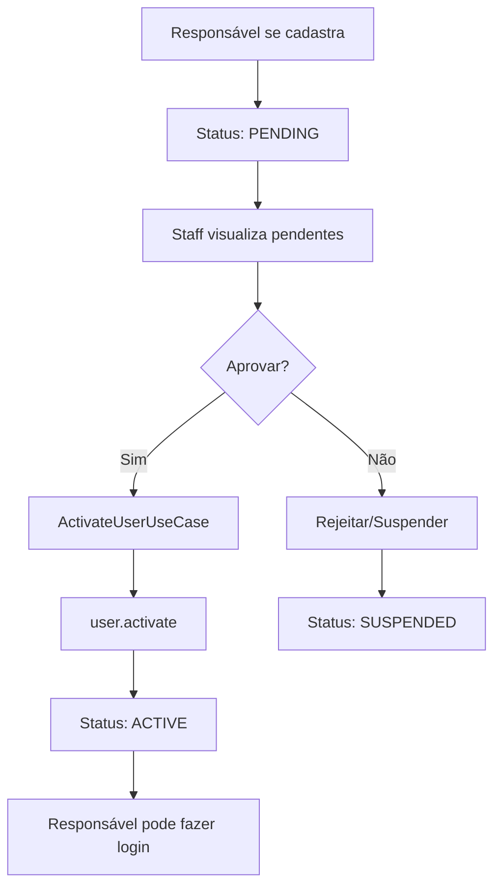

---

## 6. Hierarquia de Value Objects

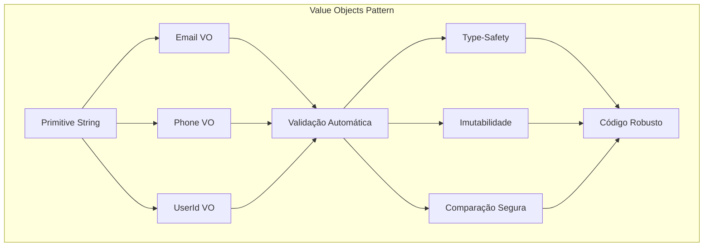

---

## 7. Roles e Permissões

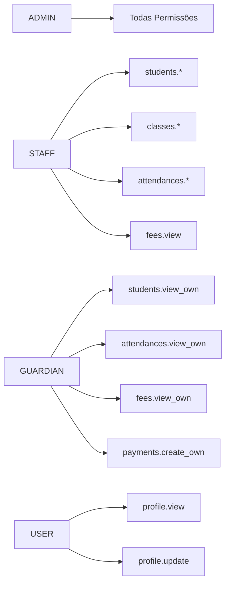

---

## 8. Estados de Usuário (Status)

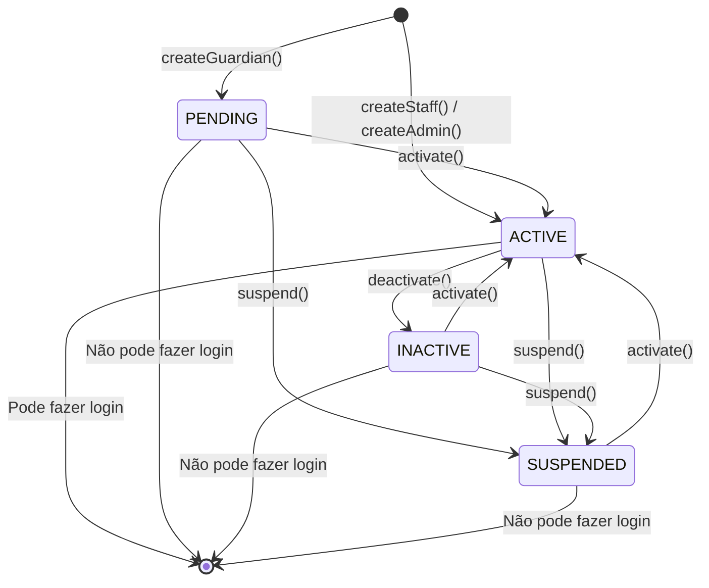

---

## 9. Multi-Tenant (School-Based)

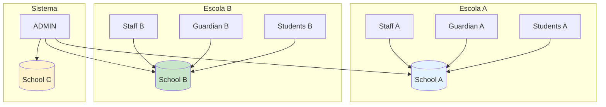

---

## 10. Dependency Injection

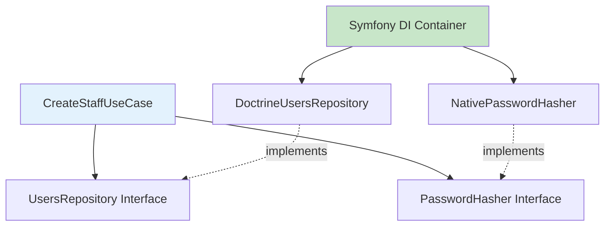

---

## 11. Request → Response Flow

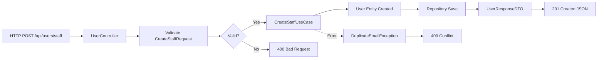

---

## 12. Testes (TDD Layers)

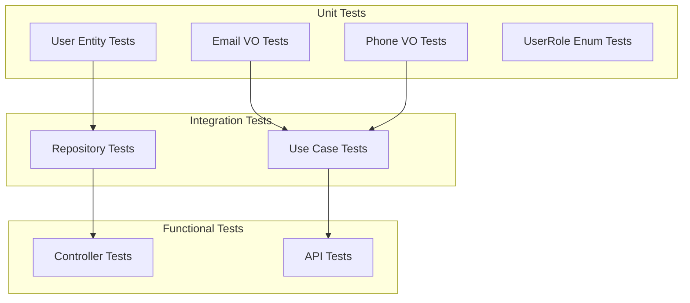

---

## 13. Padrões de Design Aplicados

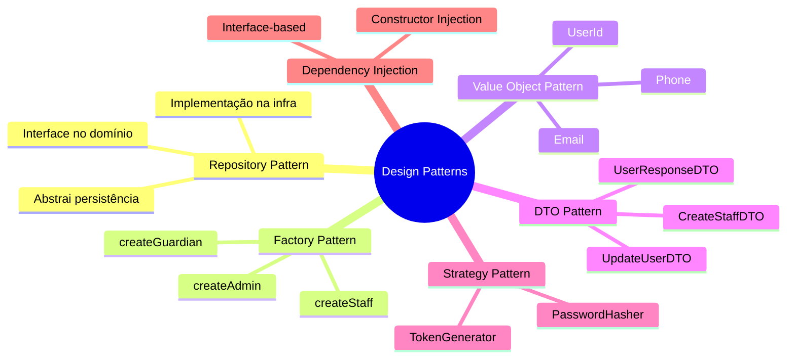

---

## 14. Exception Handling

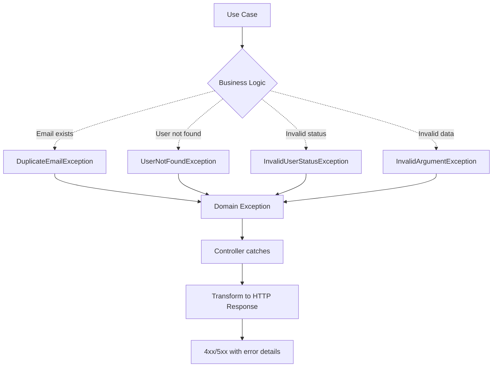

---

## 15. Clean Architecture Circles

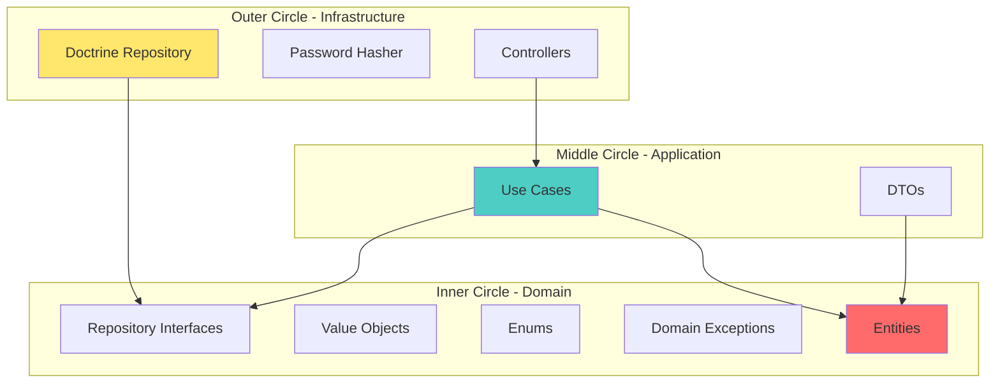

---

## Resumo Visual

### Fluxo Completo

```
HTTP Request
    ↓
Controller (Presentation)
    ↓
Use Case (Application)
    ↓
Repository Interface (Domain Contract)
    ↓
Doctrine Repository (Infrastructure)
    ↓
Database
    ↓
Response DTO
    ↓
JSON Response
```

### Camadas de Validação

```
1. Controller: Validação de entrada (Symfony Validator)
2. Value Object: Validação de formato (Email, Phone)
3. Entity: Validação de regras de negócio
4. Repository: Validação de unicidade (email exists)
```

### Separação de Responsabilidades

| Camada | Responsabilidade | Exemplo |
|--------|------------------|---------|
| Domain | Regras de negócio | `user.canLogin()` |
| Application | Orquestração | `CreateStaffUseCase` |
| Infrastructure | Implementação técnica | `DoctrineRepository` |
| Presentation | HTTP/JSON | `UserController` |

---

**Para mais detalhes**: Veja [`USERS_MODULE_ARCHITECTURE.md`](USERS_MODULE_ARCHITECTURE.md)
